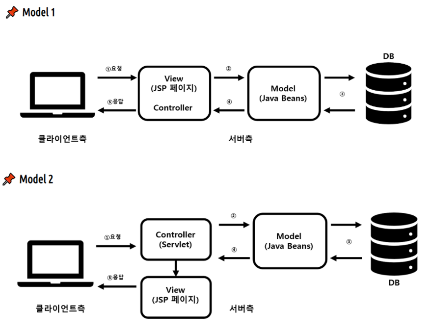

# MVC_패턴이란_무엇인가

MVC 패턴이란

- 디자인 패턴 중 하나
- Model, View, Controller의 약자로, 프로젝트 구성 요소를 이 3가지로 나눔

Model

- 모든 데이터의 집합 (정보, 데이터베이스, 상수, 변수 등)
- 규칙
    - 사용자가 편집하길 원하는 모든 데이터를 가지고 있어야만 함
    - 뷰나 컨트롤러에 대해서 어떠한 정보도 알지 말아야 함 → 직접 참조해서 수정 X
    - 변경이 일어나면, 변경 통지에 대한 처리방법을 구현해야 함
    

View

- 사용자 인터페이스, 객체의 출력(화면)
- 규칙
    - 모델이 가지고 있는 정보를 따로 저장해서는 안됨
    - 모델이나 컨트롤러와 같이 다른 구성 요소를 몰라야 함
    - 변경이 일어나면, 변경 통지에 대한 처리방법을 구현해야 함
    

Controller

- 데이터와 사용자를 이어줌, 사용자가 요청하는 이벤트들을 수행
- 규칙
    - 모델이냐 뷰에 대해서 알고 있어야 함
    - 모델이나 뷰의 변경을 모니터링해야 함 → 변경을 모델, 뷰로 통지

MVC 패턴의 장점

- 역할을 분리하여 맡은 부분에 집중 가능
- 모델과 뷰가 분리되어있어, 데이터를 여러 방식으로 표현 가능
- 입력과 출력 처리의 독립
- 향후 유지 보수에 용이
- 중복 코딩의 가능성 제거
- 애플리케이션의 확장에 유리하고 유연함

구현 예시

